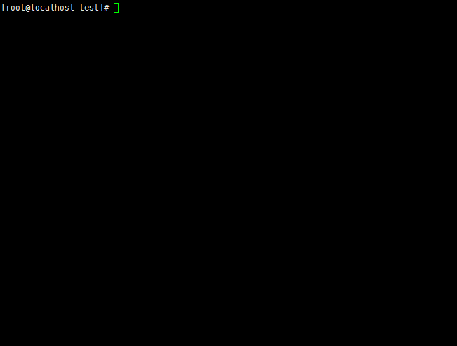

<link href="/JavaCook/css/common.css" rel="stylesheet">
<link href="https://cdn.bootcss.com/font-awesome/4.7.0/css/font-awesome.min.css" rel="stylesheet">

    <ul class="nav">
        <li>
            
        </li>
        <li class="drop-down">
            <a href="#">JAVA
                <i class="fa fa-sort-desc" aria-hidden="true"></i>
            </a>
            <ul class="drop-down-content">
                <li>
                    <a href="/JavaCook/doc/basic/">Basic</a>
                </li>
                <li>
                    <a href="/JavaCook/doc/jvm/">JVM</a>
                </li>
                <li>
                    <a href="/JavaCook/doc/concurrency/">Concurrency</a>
                </li>
                <li>
                    <a href="/JavaCook/doc/spring/">Spring</a>
                </li>
            </ul>
        </li>
        <li class="drop-down">
            <a href="#">C Algorithms
                <i class="fa fa-sort-desc" aria-hidden="true"></i>
            </a>
            <ul class="drop-down-content">
                <li>
                    <a href="/JavaCook/doc/C_Plus/">Basic</a>
                </li>
            </ul>
        </li>
        <li class="drop-down">
            <a href="#">Big Data
                <i class="fa fa-sort-desc" aria-hidden="true"></i>
            </a>
            <ul class="drop-down-content">
                <li>
                    <a href="/JavaCook/doc/hadoop/">Hadoop</a>
                </li>
                <li>
                    <a href="/JavaCook/doc/kafka/">Kafka</a>
                </li>
                <li>
                    <a href="/JavaCook/doc/spark/">Spark</a>
                </li>
                <li>
                    <a href="/JavaCook/doc/mahout/">Mahout</a>
                </li>
            </ul>
        </li>
        <li>
            <a href="https://github.com/memorylorry/JavaCook">
                <i class="menu-logo fa fa-github" aria-hidden="true"></i>view</a>
        </li>
    </ul>

## SpringDemos5
These are some simple demos for fresher. You could refer to them to know spring mvc.

## Content
 <a href="./src/HelloWorld">HelloWorld</a> 
 <a href="./src/HelloWorld2">HelloWorld2</a> 
 <a href="./src/MVCFrame">MVCFrame</a> 
 <a href="./src/SpringBootBaisc">SpringBootBaisc</a> 
 <a href="./src/SpringSecurityBasic">SpringSecurityBasic</a> 
 <a href="./src/URIPatterns">URIPatterns</a> 
 <a href="./src/MsgConverterBasic">MsgConverterBasic</a> 
 <a href="./src/HTTPHandlerMethod">HTTPHandlerMethod</a> 
 <a href="./src/ViewerResolver">ViewerResolver</a> 
 <a href="./src/SecurityJDBCLoginDemo">SecurityJDBCLoginDemo</a> 

## Clone Demos which you wanna get

### Guide to git One Directory from your git resposibilty
1. Locate one NULL directory. And init git resposibilty: 
> git init
2. This creates an empty repository with your remote, and fetches all objects but doesn't check them out:
> git remote add -f origin https://github.com/memorylorry/SpringDemos5.git
3. Then do:
> git config core.sparseCheckout true

> echo "MVCFrame" >> .git/info/sparse-checkout

> echo "someDirYourWannaGet" >> .git/info/sparse-checkout
4. Finally, Pull it:
> git pull origin master

Now you could see which directories your wanna pull is here! Check out it.
